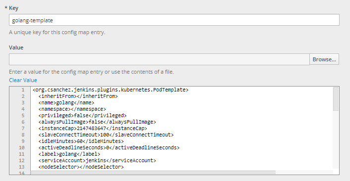
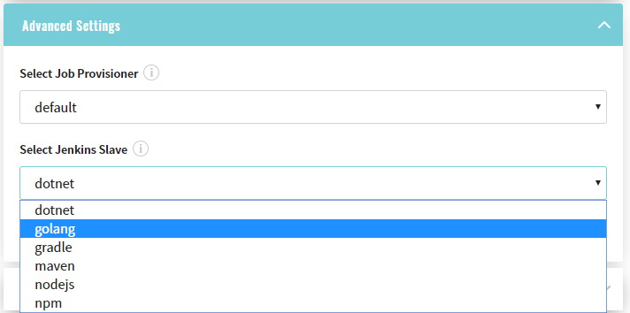

## Add Jenkins Slave

Follow the steps below to add a new Jenkins slave:

* Add a new template for Jenkins Slave by navigating to the jenkins-slaves config map under the EDP namespace. Fill in the Key field and add a value:

    

_**Note:** To copy an example of template for Jenkins Slave, navigate to examples/jenkins-slave/maven and replace it with your values. The name and label properties should be unique;_
    
* Open Jenkins to ensure that everything is added correctly. Click the Manage Jenkins option, navigate to the Configure System menu, and scroll down to the Kubernetes Pod Template with the necessary data: 

3. As a result, the newly added Jenkins slave will be available in the Advanced Settings block of the Admin Console tool during the codebase creation:
