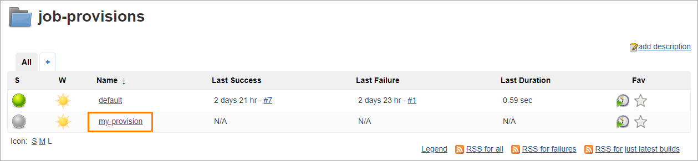

## Add Job Provision

Jenkins uses the job provisions pipelines to create the application folder, and the code-review, build and create-release pipelines for the application.
These pipelines should be located in a special job-provisions folder in Jenkins. By default, the Jenkins operator creates the default pipeline that is used for Maven, Gradle, and DotNet applications.

Follow the steps below to add a new job provision:
1. Open Jenkins and add an item into the job-provisions, scroll down to the _Copy from_ field and enter "default", type the name of a new job-provision and click ENTER:

2. The new job provision will be added with the following default template:  

```java
import groovy.json.*
import jenkins.model.Jenkins
import hudson.model.*

Jenkins jenkins = Jenkins.instance
def stages = [:]
def jiraIntegrationEnabled = Boolean.parseBoolean("${JIRA_INTEGRATION_ENABLED}" as String)
def commitValidateStage = jiraIntegrationEnabled ? ',{"name": "commit-validate"}' : ''
def createJIMStage = jiraIntegrationEnabled ? ',{"name": "create-jira-issue-metadata"}' : ''
def buildTool = "${BUILD_TOOL}"
def goBuildStage = buildTool.toString() == "go" ? ',{"name": "build"}' : ',{"name": "compile"}'

stages['Code-review-application'] = '[{"name": "gerrit-checkout"}' + "${commitValidateStage}" + goBuildStage +
 ',{"name": "tests"},[{"name": "sonar"},{"name": "dockerfile-lint"},{"name": "helm-lint"}]]'
stages['Code-review-library'] = '[{"name": "gerrit-checkout"}' + "${commitValidateStage}" +
 ',{"name": "compile"},{"name": "tests"},' +
        '{"name": "sonar"}]'
stages['Code-review-autotests'] = '[{"name": "gerrit-checkout"}' + "${commitValidateStage}" +
 ',{"name": "tests"},{"name": "sonar"}]'
stages['Code-review-default'] = '[{"name": "gerrit-checkout"}' + "${commitValidateStage}" + ']'
stages['Code-review-library-terraform'] = '[{"name": "checkout"},{"name": "terraform-lint"}]'

stages['Build-library-maven'] = '[{"name": "checkout"},{"name": "get-version"},{"name": "compile"},' +
        '{"name": "tests"},{"name": "sonar"},{"name": "build"},{"name": "push"}' + "${createJIMStage}" + ',{"name": "git-tag"}]'
stages['Build-library-npm'] = stages['Build-library-maven']
stages['Build-library-gradle'] = stages['Build-library-maven']
stages['Build-library-dotnet'] = '[{"name": "checkout"},{"name": "get-version"},{"name": "compile"},' +
        '{"name": "tests"},{"name": "sonar"},{"name": "push"}' + "${createJIMStage}" + ',{"name": "git-tag"}]'
stages['Build-library-python'] = '[{"name": "checkout"},{"name": "get-version"},{"name": "compile"},' +
        '{"name": "tests"},{"name": "sonar"},{"name": "push"}' + "${createJIMStage}" + ',{"name": "git-tag"}]'
stages['Build-library-terraform'] = '[{"name": "checkout"},{"name": "terraform-lint"},{"name": "terraform-plan"},{"name": "terraform-apply"}]'

stages['Build-application-maven'] = '[{"name": "checkout"},{"name": "get-version"},{"name": "compile"},' +
        '{"name": "tests"},[{"name": "sonar"},{"name": "helm-verify"}],{"name": "build"},{"name": "build-image-kaniko"},' +
        '{"name": "push"}' + "${createJIMStage}" + ',{"name": "git-tag"}]'
stages['Build-application-npm'] = stages['Build-application-maven']
stages['Build-application-gradle'] = stages['Build-application-maven']
stages['Build-application-dotnet'] = '[{"name": "checkout"},{"name": "get-version"},{"name": "compile"},' +
        '{"name": "tests"},[{"name": "sonar"},{"name": "helm-verify"}],{"name": "build-image-kaniko"},' +
        '{"name": "push"}' + "${createJIMStage}" + ',{"name": "git-tag"}]'
stages['Build-application-go'] = '[{"name": "checkout"},{"name": "get-version"},{"name": "tests"},{"name": "sonar"},' +
                                '{"name": "helm-verify"},{"name": "build"},{"name": "build-image-kaniko"}' +
                                "${createJIMStage}" + ',{"name": "git-tag"}]'
stages['Build-application-python'] = '[{"name": "checkout"},{"name": "get-version"},{"name": "compile"},' +
                                '{"name": "tests"},{"name": "helm-verify"},{"name": "sonar"},' +
                                '{"name": "build-image-kaniko"},{"name": "push"}' + "${createJIMStage}" +
                                ',{"name": "git-tag"}]'

stages['Create-release'] = '[{"name": "checkout"},{"name": "create-branch"},{"name": "trigger-job"}]'

def defaultBuild = '[{"name": "checkout"}]'

def codebaseName = "${NAME}"
def gitServerCrName = "${GIT_SERVER_CR_NAME}"
def gitServerCrVersion = "${GIT_SERVER_CR_VERSION}"
def gitCredentialsId = "${GIT_CREDENTIALS_ID ? GIT_CREDENTIALS_ID : 'gerrit-ciuser-sshkey'}"
def repositoryPath = "${REPOSITORY_PATH}"
def defaultBranch = "${DEFAULT_BRANCH}"

def codebaseFolder = jenkins.getItem(codebaseName)
if (codebaseFolder == null) {
    folder(codebaseName)
}

createListView(codebaseName, "Releases")
createReleasePipeline("Create-release-${codebaseName}", codebaseName, stages["Create-release"], "create-release.groovy",
        repositoryPath, gitCredentialsId, gitServerCrName, gitServerCrVersion, jiraIntegrationEnabled, defaultBranch)

if (buildTool.toString().equalsIgnoreCase('none')) {
    return true
}

if (BRANCH) {
    def branch = "${BRANCH}"
    def formattedBranch = "${branch.toUpperCase().replaceAll(/\\//, "-")}"
    createListView(codebaseName, formattedBranch)

    def type = "${TYPE}"
    def crKey = getStageKeyName(buildTool)
    createCiPipeline("Code-review-${codebaseName}", codebaseName, stages[crKey], "code-review.groovy",
            repositoryPath, gitCredentialsId, branch, gitServerCrName, gitServerCrVersion)

    def buildKey = "Build-${type}-${buildTool.toLowerCase()}".toString()
    if (type.equalsIgnoreCase('application') || type.equalsIgnoreCase('library')) {
        def jobExists = false
        if("${formattedBranch}-Build-${codebaseName}".toString() in Jenkins.instance.getAllItems().collect{it.name})
            jobExists = true

        createCiPipeline("Build-${codebaseName}", codebaseName, stages.get(buildKey, defaultBuild), "build.groovy",
                repositoryPath, gitCredentialsId, branch, gitServerCrName, gitServerCrVersion)

        if(!jobExists)
          queue("${codebaseName}/${formattedBranch}-Build-${codebaseName}")
    }
}

def createCiPipeline(pipelineName, codebaseName, codebaseStages, pipelineScript, repository, credId, watchBranch, gitServerCrName, gitServerCrVersion) {
    pipelineJob("${codebaseName}/${watchBranch.toUpperCase().replaceAll(/\\//, "-")}-${pipelineName}") {
        logRotator {
            numToKeep(10)
            daysToKeep(7)
        }
        triggers {
            gerrit {
                events {
                    if (pipelineName.contains("Build"))
                        changeMerged()
                    else
                        patchsetCreated()
                }
                project("plain:${codebaseName}", ["plain:${watchBranch}"])
            }
        }
        definition {
            cpsScm {
                scm {
                    git {
                        remote {
                            url(repository)
                            credentials(credId)
                        }
                        branches("${watchBranch}")
                        scriptPath("${pipelineScript}")
                    }
                }
                parameters {
                    stringParam("GIT_SERVER_CR_NAME", "${gitServerCrName}", "Name of Git Server CR to generate link to Git server")
                    stringParam("GIT_SERVER_CR_VERSION", "${gitServerCrVersion}", "Version of GitServer CR Resource")
                    stringParam("STAGES", "${codebaseStages}", "Consequence of stages in JSON format to be run during execution")
                    stringParam("GERRIT_PROJECT_NAME", "${codebaseName}", "Gerrit project name(Codebase name) to be build")
                    if (pipelineName.contains("Build"))
                        stringParam("BRANCH", "${watchBranch}", "Branch to build artifact from")
                }
            }
        }
    }
}

def getStageKeyName(buildTool) {
    if (buildTool.toString().equalsIgnoreCase('terraform')) {
        return "Code-review-library-terraform"
    }
    def buildToolsOutOfTheBox = ["maven","npm","gradle","dotnet","none","go","python"]
    def supBuildTool = buildToolsOutOfTheBox.contains(buildTool.toString())
    return supBuildTool ? "Code-review-${TYPE}" : "Code-review-default"
}

def createReleasePipeline(pipelineName, codebaseName, codebaseStages, pipelineScript, repository, credId,
 gitServerCrName, gitServerCrVersion, jiraIntegrationEnabled, defaultBranch) {
    pipelineJob("${codebaseName}/${pipelineName}") {
        logRotator {
            numToKeep(14)
            daysToKeep(30)
        }
        definition {
            cpsScm {
                scm {
                    git {
                        remote {
                            url(repository)
                            credentials(credId)
                        }
                        branches("${defaultBranch}")
                        scriptPath("${pipelineScript}")
                    }
                }
                parameters {
                    stringParam("STAGES", "${codebaseStages}", "")
                    if (pipelineName.contains("Create-release")) {
                        stringParam("JIRA_INTEGRATION_ENABLED", "${jiraIntegrationEnabled}", "Is Jira integration enabled")
                        stringParam("GERRIT_PROJECT", "${codebaseName}", "")
                        stringParam("RELEASE_NAME", "", "Name of the release(branch to be created)")
                        stringParam("COMMIT_ID", "", "Commit ID that will be used to create branch from for new release. If empty, HEAD of master will be used")
                        stringParam("GIT_SERVER_CR_NAME", "${gitServerCrName}", "Name of Git Server CR to generate link to Git server")
                        stringParam("GIT_SERVER_CR_VERSION", "${gitServerCrVersion}", "Version of GitServer CR Resource")
                        stringParam("REPOSITORY_PATH", "${repository}", "Full repository path")
                        stringParam("DEFAULT_BRANCH", "${defaultBranch}", "Default repository branch")
                    }
                }
            }
        }
    }
}

def createListView(codebaseName, branchName) {
    listView("${codebaseName}/${branchName}") {
        if (branchName.toLowerCase() == "releases") {
            jobFilters {
                regex {
                    matchType(MatchType.INCLUDE_MATCHED)
                    matchValue(RegexMatchValue.NAME)
                    regex("^Create-release.*")
                }
            }
        } else {
            jobFilters {
                regex {
                    matchType(MatchType.INCLUDE_MATCHED)
                    matchValue(RegexMatchValue.NAME)
                    regex("^${branchName}-(Code-review|Build).*")
                }
            }
        }
        columns {
            status()
            weather()
            name()
            lastSuccess()
            lastFailure()
            lastDuration()
            buildButton()
        }
    }
}
``` 
_**NOTE**: If you install the job provisioner in EKS, pay attention to change the indicated stage value {"name": "build-image"} to {"name" "build-image-kaniko"}._

The job-provisions pipeline consists of the following parameters:

* NAME - the application name;
* TYPE - the codebase type (the application / library / autotest); 
* BUILD_TOOL - a tool that is used to build the application;
* BRANCH - a branch name;
* GIT_SERVER_CR_NAME - the name of the application Git server custom resource 
* GIT_SERVER_CR_VERSION - the version of the application Git server custom resource
* GIT_CREDENTIALS_ID - the secret name where Git server credentials are stored (default 'gerrit-ciuser-sshkey');
* REPOSITORY_PATH - the full repository path;
* JIRA_INTEGRATION_ENABLED - the Jira integration is enabled or not;
* DEFAULT_BRANCH - the default repository branch.

_**NOTE**: The default template should be changed if there is another creation logic for the code-review, build and create-release pipelines.
Furthermore, all pipeline types should have the necessary stages as well._

3.Check the availability of the job-provision in Admin Console. Simply navigate to the **Advanced Settings** block during the codebase creation: 
  
    
