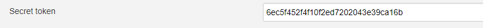

# GitLab Integration

Discover the steps below to apply the GitLab integration correctly:

1. Create access token in **Gitlab**:
    * Log in to **GitLab**;
    * In the top-right corner, click your avatar and select **Settings**;
    * On the **User Settings** menu, select **Access Tokens**;
    * Choose a name and an optional expiry date for the token;
    * In the Scopes block, select the *api* scope for the token;

        

    * Click the **Create personal access token** button.

    *Note: Make sure to save the access token as there won`t be the ability to access it once again.*

2. Install **GitLab plugin** by navigating to *Manage Jenkins* and switching to plugin manager, select the **GitLab Plugin** check box:

    

3. Create Jenkins Credential ID by navigating to *Jenkins -> Credentials -> System -> Global Credentials -> Add Credentials*:

    * Select GitLab API token;
    * Select Global scope;
    * API token - the **Access Token** that was created earlier;
    * ID - the **gitlab-access-token** ID;
    * Description - the description of the current Credential ID;

    

4. Configure **Gitlab plugin** by navigating to *Manage Jenkins -> Configure System* and fill in the **GitLab plugin** settings:

    * Connection name - connection name;
    * Gitlab host URL - a host URL to GitLab;
    * Credentials - credentials with **Access Token** to GitLab (**gitlab-access-token**);

    

5. Create WebHook job with the following name **Gitlab-webhook-listener** by navigating to *Jenkins -> New Item* and click **Pipeline**.
In the *Enter an item name field*, type the **Gitlab-webhook-listener** and click OK:

    

    * In the **Build Triggers** section, select the *Build when a change is pushed to GitLab. GitLab webhook URL* check box and examine all options;
    * In the **Build Triggers** section, open *Advanced settings* and generate a secret token;

    

    * Insert script into the **Pipeline** section;

    ```
    node("master") {
        println "[JENKINS][DEBUG] Webhook parameters:"
        sh "printenv|sort|grep \"^gitlab\""
        if(!env.gitlabActionType)
            error "[JENKINS][DEBUG] Job was triggered manually. Skipping..."
        try{
            stage('Trigger CI Job') {
                println "[JENKINS][DEBUG] Action type: ${gitlabActionType}";
                println "[JENKINS][DEBUG] Commit ID: ${gitlabMergeRequestLastCommit}"
                switch(gitlabActionType) {
                    case "MERGE":
                        currentBuild.displayName = "${BUILD_NUMBER}-${gitlabSourceRepoName}-${gitlabSourceBranch}-${gitlabActionType}-${gitlabMergeRequestState}"
                        if(gitlabMergeRequestState == "opened") {
                            updateGitlabCommitStatus state: "running"
                            build job: "${gitlabSourceRepoName}/MASTER-Code-review-${gitlabSourceRepoName}", parameters: [string(name: "BRANCH", value: gitlabSourceBranch)]
                            updateGitlabCommitStatus state: "success"
                        }
                        else if(gitlabMergeRequestState == "merged") {
                            build job: "${gitlabSourceRepoName}/${gitlabTargetBranch.toUpperCase()}-Build-${gitlabSourceRepoName}", parameters: [string(name: "BRANCH", value: gitlabTargetBranch)]
                        }
                        else {
                            println "[JENKINS][DEBUG] Unsupportable MR state: \"${gitlabMergeRequestState}\". Skipping...";
                        }
                        break;
                    case "PUSH":
                        if(gitlabSourceBranch == "master" && gitlabTargetBranch == "master") {
                            currentBuild.displayName = "${BUILD_NUMBER}-${gitlabSourceRepoName}-${gitlabSourceBranch}-MERGE-merged"
                            build job: "${gitlabSourceRepoName}/MASTER-Build-${gitlabSourceRepoName}", parameters: [string(name: "BRANCH", value: "master")]
                            break;
                        }
                        currentBuild.displayName = "${BUILD_NUMBER}-${gitlabSourceRepoName}-${gitlabSourceBranch}-${gitlabActionType}"
                        updateGitlabCommitStatus state: "running"
                        build job: "${gitlabSourceRepoName}/MASTER-Code-review-${gitlabSourceRepoName}", parameters: [string(name: "BRANCH", value: gitlabSourceBranch)]
                        updateGitlabCommitStatus state: "success"
                        break;
                    default:
                        println "[JENKINS][DEBUG] Unsupportable event type: \"${gitlabActionType}\". Skipping...";
                        break;
                }
            }
        }
        catch (Exception e) {
            updateGitlabCommitStatus state: "failed"
            throw e
        }
    }
    ```

6. Create a new Job Provision. Navigate to the Jenkins main page and open the *job-provisions* folder:

    * Click *New Item*;
    * Type the name;
    * Select *Freestyle project* and click OK;
    * Select the *This project is parameterized* check box and add a few input parameters as the following strings:
        * NAME;
        * TYPE;
        * BUILD_TOOL;
        * BRANCH;
        * GIT_SERVER_CR_NAME;
        * GIT_SERVER_CR_VERSION;
        * GIT_SERVER;
        * GIT_SSH_PORT;
        * GIT_USERNAME;
        * GIT_CREDENTIALS_ID;
        * REPOSITORY_PATH;

    * Check the *Execute concurrent builds if necessary* option;

    * In the **Build** section, perform the following:
        * Select *DSL Script*;
        * Select the *Use the provided DSL script* check box:

   

    * As soon as all the steps above are performed, insert the code:

    ```

    import groovy.json.*
    import jenkins.model.Jenkins

    Jenkins jenkins = Jenkins.instance
    def stages = [:]

    stages['Code-review-application-maven'] = '[{"name": "checkout"},{"name": "compile"},' +
            '{"name": "tests"}, {"name": "sonar"}]'
    stages['Code-review-application-npm'] = stages['Code-review-application-maven']
    stages['Code-review-application-gradle'] = stages['Code-review-application-maven']
    stages['Code-review-application-dotnet'] = stages['Code-review-application-maven']
    stages['Code-review-application-terraform'] = '[{"name": "checkout"},{"name": "tool-init"},{"name": "lint"}]'
    stages['Code-review-application-helm'] = '[{"name": "checkout"},{"name": "lint"}]'
    stages['Code-review-application-docker'] = '[{"name": "checkout"},{"name": "lint"}]'
    stages['Code-review-library'] = '[{"name": "checkout"},{"name": "compile"},{"name": "tests"},' +
            '{"name": "sonar"}]'
    stages['Code-review-autotests'] = '[{"name": "checkout"},{"name": "tests"},{"name": "sonar"}]'
    stages['Build-library-maven'] = '[{"name": "checkout"},{"name": "get-version"},{"name": "compile"},' +
            '{"name": "tests"},{"name": "sonar"},{"name": "build"},{"name": "push"},{"name": "git-tag"}]'
    stages['Build-library-npm'] = stages['Build-library-maven']
    stages['Build-library-gradle'] = stages['Build-library-maven']
    stages['Build-library-dotnet'] = '[{"name": "checkout"},{"name": "get-version"},{"name": "compile"},' +
            '{"name": "tests"},{"name": "sonar"},{"name": "push"},{"name": "git-tag"}]'
    stages['Build-application-maven'] = '[{"name": "checkout"},{"name": "get-version"},{"name": "compile"},' +
            '{"name": "tests"},{"name": "sonar"},{"name": "build"},{"name": "build-image-from-dockerfile"},' +
            '{"name": "push"},{"name": "git-tag"}]'
    stages['Build-application-npm'] = stages['Build-application-maven']
    stages['Build-application-gradle'] = stages['Build-application-maven']
    stages['Build-application-dotnet'] = '[{"name": "checkout"},{"name": "get-version"},{"name": "compile"},' +
            '{"name": "tests"},{"name": "sonar"},{"name": "build-image"},' +
            '{"name": "push"},{"name": "git-tag"}]'
    stages['Build-application-terraform'] = '[{"name": "checkout"},{"name": "tool-init"},' +
            '{"name": "lint"},{"name": "git-tag"}]'
    stages['Build-application-helm'] = '[{"name": "checkout"},{"name": "lint"}]'
    stages['Build-application-docker'] = '[{"name": "checkout"},{"name": "lint"}]'
    stages['Create-release'] = '[{"name": "checkout"},{"name": "create-branch"},{"name": "trigger-job"}]'

    def codebaseName = "${NAME}"
    def buildTool = "${BUILD_TOOL}"
    def gitServerCrName = "${GIT_SERVER_CR_NAME}"
    def gitServerCrVersion = "${GIT_SERVER_CR_VERSION}"
    def gitServer = "${GIT_SERVER ? GIT_SERVER : 'gerrit'}"
    def gitSshPort = "${GIT_SSH_PORT ? GIT_SSH_PORT : '29418'}"
    def gitUsername = "${GIT_USERNAME ? GIT_USERNAME : 'jenkins'}"
    def gitCredentialsId = "${GIT_CREDENTIALS_ID ? GIT_CREDENTIALS_ID : 'gerrit-ciuser-sshkey'}"
    def defaultRepoPath = "ssh://${gitUsername}@${gitServer}:${gitSshPort}/${codebaseName}"
    def repositoryPath = "${REPOSITORY_PATH ? REPOSITORY_PATH : defaultRepoPath}"

    def codebaseFolder = jenkins.getItem(codebaseName)
    if (codebaseFolder == null) {
        folder(codebaseName)
    }

    createListView(codebaseName, "Releases")
    createReleasePipeline("Create-release-${codebaseName}", codebaseName, stages["Create-release"], "create-release.groovy",
            repositoryPath, gitCredentialsId, gitServerCrName, gitServerCrVersion)

    if (BRANCH == "master" && gitServerCrName != "gerrit") {
        def branch = "${BRANCH}"
        def formattedBranch = "${branch.toUpperCase().replaceAll(/\\//, "-")}"
        createListView(codebaseName, formattedBranch)

        def type = "${TYPE}"
        createCiPipeline("Code-review-${codebaseName}", codebaseName, stages["Code-review-${type}-${buildTool.toLowerCase()}"], "code-review.groovy",
                repositoryPath, gitCredentialsId, branch, gitServerCrName, gitServerCrVersion)

        if (type.equalsIgnoreCase('application') || type.equalsIgnoreCase('library')) {
            def jobExists = false
            if("${formattedBranch}-Build-${codebaseName}".toString() in Jenkins.instance.getAllItems().collect{it.name}) {
               jobExists = true
            }
            createCiPipeline("Build-${codebaseName}", codebaseName, stages["Build-${type}-${buildTool.toLowerCase()}"], "build.groovy",
                    repositoryPath, gitCredentialsId, branch, gitServerCrName, gitServerCrVersion)
            if(!jobExists) {
                queue("${codebaseName}/${formattedBranch}-Build-${codebaseName}")
            }
        }
        registerWebHook(repositoryPath)
        return
    }

    if (BRANCH) {
        def branch = "${BRANCH}"
        def formattedBranch = "${branch.toUpperCase().replaceAll(/\\//, "-")}"
        createListView(codebaseName, formattedBranch)

        def type = "${TYPE}"
        createCiPipeline("Code-review-${codebaseName}", codebaseName, stages["Code-review-${type}-${buildTool.toLowerCase()}"], "code-review.groovy",
                repositoryPath, gitCredentialsId, branch, gitServerCrName, gitServerCrVersion)

        if (type.equalsIgnoreCase('application') || type.equalsIgnoreCase('library')) {
            def jobExists = false
            if("${formattedBranch}-Build-${codebaseName}".toString() in Jenkins.instance.getAllItems().collect{it.name}) {
               jobExists = true
            }
            createCiPipeline("Build-${codebaseName}", codebaseName, stages["Build-${type}-${buildTool.toLowerCase()}"], "build.groovy",
                    repositoryPath, gitCredentialsId, branch, gitServerCrName, gitServerCrVersion)
           if(!jobExists) {
             queue("${codebaseName}/${formattedBranch}-Build-${codebaseName}")
           }
        }
    }


    def createCiPipeline(pipelineName, codebaseName, codebaseStages, pipelineScript, repository, credId, watchBranch = "master", gitServerCrName, gitServerCrVersion) {
        pipelineJob("${codebaseName}/${watchBranch.toUpperCase().replaceAll(/\\//, "-")}-${pipelineName}") {
            logRotator {
                numToKeep(10)
                daysToKeep(7)
            }
            if(gitServerCrName == "gerrit") {
                triggers {
                    gerrit {
                        events {
                            if (pipelineName.contains("Build"))
                                changeMerged()
                            else
                                patchsetCreated()
                        }
                        project("plain:${codebaseName}", ["plain:${watchBranch}"])
                    }
                }
            }
            definition {
                cpsScm {
                    scm {
                        git {
                            remote {
                                url(repository)
                                credentials(credId)
                            }
                            if (watchBranch == "FB")
                                branches("\${BRANCH}")
                            else
                                branches("${watchBranch}")
                            scriptPath("${pipelineScript}")
                        }
                    }
                    parameters {
                        stringParam("GIT_SERVER_CR_NAME", "${gitServerCrName}", "Name of Git Server CR to generate link to Git server")
                        stringParam("GIT_SERVER_CR_VERSION", "${gitServerCrVersion}", "Version of GitServer CR Resource")
                        stringParam("STAGES", "${codebaseStages}", "Consequence of stages in JSON format to be run during execution")
                        stringParam("GERRIT_PROJECT_NAME", "${codebaseName}", "Gerrit project name(Codebase name) to be build")
                        if (pipelineName.contains("Build"))
                            stringParam("BRANCH", "${watchBranch}", "Branch to build artifact from")
                    }
                }
            }
        }
    }

    def createReleasePipeline(pipelineName, codebaseName, codebaseStages, pipelineScript, repository, credId, gitServerCrName, gitServerCrVersion) {
        pipelineJob("${codebaseName}/${pipelineName}") {
            logRotator {
                numToKeep(14)
                daysToKeep(30)
            }
            definition {
                cpsScm {
                    scm {
                        git {
                            remote {
                                url(repository)
                                credentials(credId)
                            }
                            branches("master")
                            scriptPath("${pipelineScript}")
                        }
                    }
                    parameters {
                        stringParam("STAGES", "${codebaseStages}", "")
                        if (pipelineName.contains("Create-release")) {
                            stringParam("GERRIT_PROJECT", "${codebaseName}", "")
                            stringParam("RELEASE_NAME", "", "Name of the release(branch to be created)")
                            stringParam("COMMIT_ID", "", "Commit ID that will be used to create branch from for new release. If empty, HEAD of master will be used")
                            stringParam("GIT_SERVER_CR_NAME", "${gitServerCrName}", "Name of Git Server CR to generate link to Git server")
                            stringParam("GIT_SERVER_CR_VERSION", "${gitServerCrVersion}", "Version of GitServer CR Resource")
                            stringParam("REPOSITORY_PATH", "${repository}", "Full repository path")
                        }
                    }
                }
            }
        }
    }

    def createListView(codebaseName, branchName) {
        listView("${codebaseName}/${branchName}") {
            if (branchName.toLowerCase() == "releases") {
                jobFilters {
                    regex {
                        matchType(MatchType.INCLUDE_MATCHED)
                        matchValue(RegexMatchValue.NAME)
                        regex("^Create-release.*")
                    }
                }
            } else {
                jobFilters {
                    regex {
                        matchType(MatchType.INCLUDE_MATCHED)
                        matchValue(RegexMatchValue.NAME)
                        regex("^${branchName}-(Code-review|Build).*")
                    }
                }
            }
            columns {
                status()
                weather()
                name()
                lastSuccess()
                lastFailure()
                lastDuration()
                buildButton()
            }
        }
    }

    def registerWebHook(repositoryPath) {
        if(!Jenkins.getInstance().getItemByFullName("Gitlab-webhook-listener")) {
            println("Job \"Gitlab-webhook-listener\" doesn't exist. Webhook is not configured.")
            return
        }

        def apiUrl = 'https://' + repositoryPath.split('@')[1].replaceAll('/',"%2F").replace(':22%2F', '/api/v4/projects/') + '/hooks'
        def webhookListenerJob = Jenkins.getInstance().getItemByFullName("Gitlab-webhook-listener")
        def jobUrl = webhookListenerJob.getAbsoluteUrl().replace('/job/','/project/')
        def triggersMap = webhookListenerJob.getTriggers()

        triggersMap.each { key, value ->
            webhookSecretToken = value.getSecretToken()
        }

        def webhookConfig = [:]
        webhookConfig["url"]                        = jobUrl
        webhookConfig["push_events"]                = "true"
        webhookConfig["issues_events"]              = "true"
        webhookConfig["confidential_issues_events"] = "true"
        webhookConfig["merge_requests_events"]      = "true"
        webhookConfig["tag_push_events"]            = "true"
        webhookConfig["note_events"]                = "true"
        webhookConfig["job_events"]                 = "true"
        webhookConfig["pipeline_events"]            = "true"
        webhookConfig["wiki_page_events"]           = "true"
        webhookConfig["enable_ssl_verification"]    = "true"
        webhookConfig["token"]                      = webhookSecretToken
        def requestBody = JsonOutput.toJson(webhookConfig)
        def http = new URL(apiUrl).openConnection() as HttpURLConnection
        http.setRequestMethod('POST')
        http.setDoOutput(true)
        println(apiUrl)
        http.setRequestProperty("Accept", 'application/json')
        http.setRequestProperty("Content-Type", 'application/json')
        http.setRequestProperty("Authorization", "Bearer ${getSecretValue('gitlab-access-token')}")
        http.outputStream.write(requestBody.getBytes("UTF-8"))
        http.connect()
        println(http.responseCode)

        if (http.responseCode == 201) {
            response = new JsonSlurper().parseText(http.inputStream.getText('UTF-8'))
        } else {
            response = new JsonSlurper().parseText(http.errorStream.getText('UTF-8'))
        }

        println "response: ${response}"
    }

    def getSecretValue(name) {
        def creds = com.cloudbees.plugins.credentials.CredentialsProvider.lookupCredentials(
                com.cloudbees.plugins.credentials.common.StandardCredentials.class,
                Jenkins.instance,
                null,
                null
        )

        def secret = creds.find {it.properties['id'] == name}
        return secret != null ? secret['apiToken'] : null
    }
    ```
7. After the steps above are performed, the new custom job-provision will be available in Advanced CI Settings during the application creation.

   