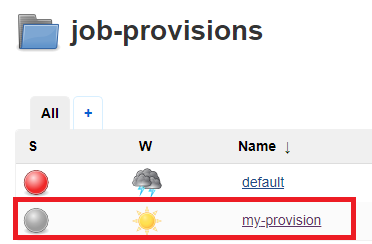
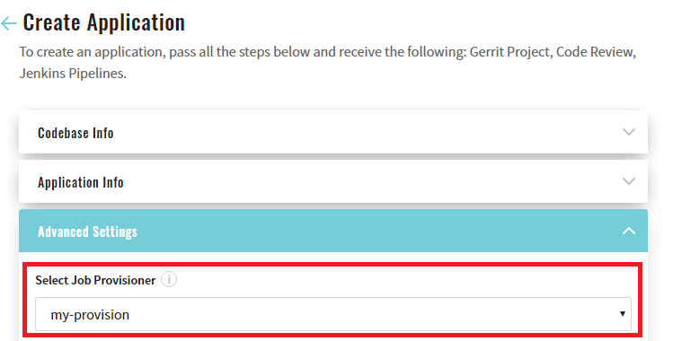

# EDP Jenkins operator

## Overview
The Jenkins operator deploys and manages EDP Jenkins instance on Kubernetes/Openshift. Jenkins instance created by the Jenkins operator is equipped with necsessary plugins.

## Jenkins Slaves

* Firstly you have to add new template for Jenkins Slave, to reach it add new key/value to 'jenkins-slaves' config map
under 'edp' namespace.


* Once you made it, go to Jenkins to ensure everything is okay: Manage Jenkins -> Configure System 
    and find 'Kubernetes Pod Template' with your data.

    
* After completing the above steps, you can use newly created Jenkins slaves during Codebase creation.


---

## 'Other' language

* 'Other' language is used for creating Codebases using custom languages different from predefined default languages.
_Note: 'Other' language is impossible for the 'Create' strategy._


* 'Other' language has configurable list of 'Build Tools'. To configure it go to 'Deployment Config' for Admin Console
 in cluster and add 'BUILD_TOOLS' env variable with your custom 'Build tools'.
_Note: 'Build Tools' should be separated by comma, e.g.: maven,gradle_


## Job provisions
Jenkins uses job provisions pipelines to create application folder, code-review, build and create-release pipelines for application. These pipelines should be placed in Jenkins in special "job-provisions" folder. By default Jenkins operator creates default pipeline which is used for Maven, Gradle, NPM and .NET applications.

Default template is the following:
```java
import groovy.json.*
import jenkins.model.Jenkins

Jenkins jenkins = Jenkins.instance
def stages = [:]

stages['Code-review-application'] = '[{"name": "gerrit-checkout"},{"name": "compile"},{"name": "tests"},' +
        '{"name": "sonar"}]'
stages['Code-review-library'] = '[{"name": "gerrit-checkout"},{"name": "compile"},{"name": "tests"},' +
        '{"name": "sonar"}]'
stages['Code-review-autotests'] = '[{"name": "gerrit-checkout"},{"name": "tests"},{"name": "sonar"}]'
stages['Code-review-default'] = '[{"name": "gerrit-checkout"}]'

stages['Build-library-maven'] = '[{"name": "checkout"},{"name": "get-version"},{"name": "compile"},' +
        '{"name": "tests"},{"name": "sonar"},{"name": "build"},{"name": "push"},{"name": "git-tag"}]'
stages['Build-library-npm'] = stages['Build-library-maven']
stages['Build-library-gradle'] = stages['Build-library-maven']
stages['Build-library-dotnet'] = '[{"name": "checkout"},{"name": "get-version"},{"name": "compile"},' +
        '{"name": "tests"},{"name": "sonar"},{"name": "push"},{"name": "git-tag"}]'

stages['Build-application-maven'] = '[{"name": "checkout"},{"name": "get-version"},{"name": "compile"},' +
        '{"name": "tests"},{"name": "sonar"},{"name": "build"},{"name": "build-image"},' +
        '{"name": "push"},{"name": "git-tag"}]'
stages['Build-application-npm'] = stages['Build-application-maven']
stages['Build-application-gradle'] = stages['Build-application-maven']
stages['Build-application-dotnet'] = '[{"name": "checkout"},{"name": "get-version"},{"name": "compile"},' +
        '{"name": "tests"},{"name": "sonar"},{"name": "build-image"},' +
        '{"name": "push"},{"name": "git-tag"}]'

stages['Create-release'] = '[{"name": "checkout"},{"name": "create-branch"},{"name": "trigger-job"}]'

def buildToolsOutOfTheBox = ["maven","npm","gradle","dotnet"]
def defaultBuild = '[{"name": "checkout"}]'

def codebaseName = "${NAME}"
def buildTool = "${BUILD_TOOL}"
def gitServerCrName = "${GIT_SERVER_CR_NAME}"
def gitServerCrVersion = "${GIT_SERVER_CR_VERSION}"
def gitCredentialsId = "${GIT_CREDENTIALS_ID ? GIT_CREDENTIALS_ID : 'gerrit-ciuser-sshkey'}"
def repositoryPath = "${REPOSITORY_PATH}"

def codebaseFolder = jenkins.getItem(codebaseName)
if (codebaseFolder == null) {
    folder(codebaseName)
}

createListView(codebaseName, "Releases")
createReleasePipeline("Create-release-${codebaseName}", codebaseName, stages["Create-release"], "create-release.groovy",
        repositoryPath, gitCredentialsId, gitServerCrName, gitServerCrVersion)

if (BRANCH) {
    def branch = "${BRANCH}"
    createListView(codebaseName, "${branch.toUpperCase()}")

    def type = "${TYPE}"
    def supBuildTool = buildToolsOutOfTheBox.contains(buildTool.toString())
    def crKey = supBuildTool ? "Code-review-${type}" : "Code-review-default"
    createCiPipeline("Code-review-${codebaseName}", codebaseName, stages.get(crKey), "code-review.groovy",
            repositoryPath, gitCredentialsId, branch, gitServerCrName, gitServerCrVersion)

    def buildKey = "Build-${type}-${buildTool.toLowerCase()}".toString()
    if (type.equalsIgnoreCase('application') || type.equalsIgnoreCase('library')) {
        createCiPipeline("Build-${codebaseName}", codebaseName, stages.get(buildKey, defaultBuild), "build.groovy",
                repositoryPath, gitCredentialsId, branch, gitServerCrName, gitServerCrVersion)
    }
}

def createCiPipeline(pipelineName, codebaseName, codebaseStages, pipelineScript, repository, credId, watchBranch = "master", gitServerCrName, gitServerCrVersion) {
    pipelineJob("${codebaseName}/${watchBranch.toUpperCase()}-${pipelineName}") {
        logRotator {
            numToKeep(10)
            daysToKeep(7)
        }
        triggers {
            gerrit {
                events {
                    if (pipelineName.contains("Build"))
                        changeMerged()
                    else
                        patchsetCreated()
                }
                project("plain:${codebaseName}", ["plain:${watchBranch}"])
            }
        }
        definition {
            cpsScm {
                scm {
                    git {
                        remote {
                            url(repository)
                            credentials(credId)
                        }
                        branches("${watchBranch}")
                        scriptPath("${pipelineScript}")
                    }
                }
                parameters {
                    stringParam("GIT_SERVER_CR_NAME", "${gitServerCrName}", "Name of Git Server CR to generate link to Git server")
                    stringParam("GIT_SERVER_CR_VERSION", "${gitServerCrVersion}", "Version of GitServer CR Resource")
                    stringParam("STAGES", "${codebaseStages}", "Consequence of stages in JSON format to be run during execution")
                    stringParam("GERRIT_PROJECT_NAME", "${codebaseName}", "Gerrit project name(Codebase name) to be build")
                    if (pipelineName.contains("Build"))
                        stringParam("BRANCH", "${watchBranch}", "Branch to build artifact from")
                }
            }
        }
    }
}

def createReleasePipeline(pipelineName, codebaseName, codebaseStages, pipelineScript, repository, credId, gitServerCrName, gitServerCrVersion) {
    pipelineJob("${codebaseName}/${pipelineName}") {
        logRotator {
            numToKeep(14)
            daysToKeep(30)
        }
        definition {
            cpsScm {
                scm {
                    git {
                        remote {
                            url(repository)
                            credentials(credId)
                        }
                        branches("master")
                        scriptPath("${pipelineScript}")
                    }
                }
                parameters {
                    stringParam("STAGES", "${codebaseStages}", "")
                    if (pipelineName.contains("Create-release")) {
                        stringParam("GERRIT_PROJECT", "${codebaseName}", "")
                        stringParam("RELEASE_NAME", "", "Name of the release(branch to be created)")
                        stringParam("COMMIT_ID", "", "Commit ID that will be used to create branch from for new release. If empty, HEAD of master will be used")
                        stringParam("GIT_SERVER_CR_NAME", "${gitServerCrName}", "Name of Git Server CR to generate link to Git server")
                        stringParam("GIT_SERVER_CR_VERSION", "${gitServerCrVersion}", "Version of GitServer CR Resource")
                        stringParam("REPOSITORY_PATH", "${repository}", "Full repository path")
                    }
                }
            }
        }
    }
}

def createListView(codebaseName, branchName) {
    listView("${codebaseName}/${branchName}") {
        if (branchName.toLowerCase() == "releases") {
            jobFilters {
                regex {
                    matchType(MatchType.INCLUDE_MATCHED)
                    matchValue(RegexMatchValue.NAME)
                    regex("^Create-release.*")
                }
            }
        } else {
            jobFilters {
                regex {
                    matchType(MatchType.INCLUDE_MATCHED)
                    matchValue(RegexMatchValue.NAME)
                    regex("^${branchName}-(Code-review|Build).*")
                }
            }
        }
        columns {
            status()
            weather()
            name()
            lastSuccess()
            lastFailure()
            lastDuration()
            buildButton()
        }
    }
}
``` 

As you see job provision pipeline should have the following parameters:
* NAME - application name
* BUILD_TOOL - tool that should be used to build application
* GIT_SERVER_CR_NAME - the name of the application Git server custom resource 
* GIT_SERVER_CR_VERSION - version of the application Git server custom resource
* GIT_CREDENTIALS_ID - secret name where credentials to Git server are stored (default 'gerrit-ciuser-sshkey')
* REPOSITORY_PATH - full repository path
* TYPE - application type (application | library | autotests) 

And should implement logic for creation of the Code-review, Build and Create-release pipelines.
Furthermore you should define 'stages' for all pipeline types

To use custom job provision you should first create it in Jenkins:

 
 
 And second, use it in AdminConsole during application creation:
 