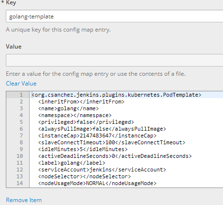
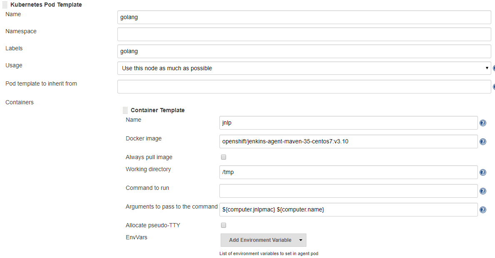
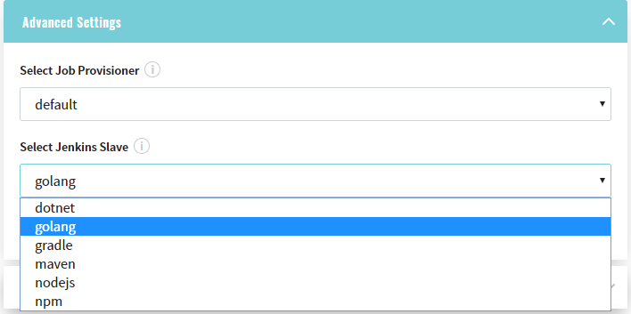
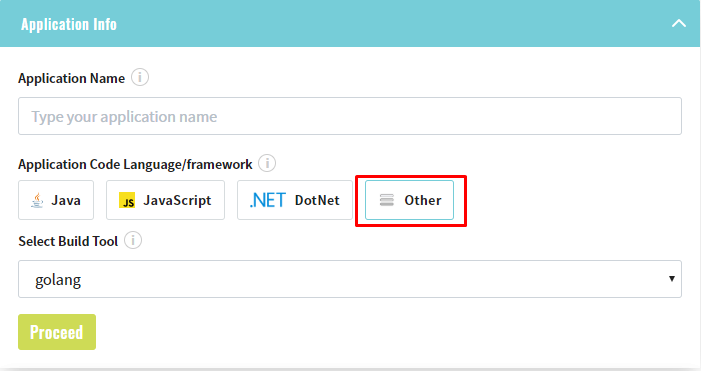
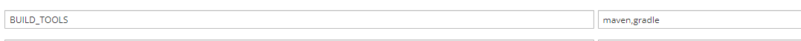

# Jenkins Slaves

* Firstly you have to add new template for Jenkins Slave, to reach it add new key/value to 'jenkins-slaves' config map
under 'edp' namespace.

* Once you made it, go to Jenkins to ensure everything is okay: Manage Jenkins -> Configure System 
    and find 'Kubernetes Pod Template' with your data.

    
* After completing the above steps, you can use newly created Jenkins slaves during Codebase creation.

---

# 'Other' language

* 'Other' language is used for creating Codebases using custom languages different from predefined default languages.
_Note: 'Other' language is impossible for the 'Create' strategy._

* 'Other' language has configurable list of 'Build Tools'. To configure it go to 'Deployment Config' for Admin Console
 in cluster and add 'BUILD_TOOLS' env variable with your custom 'Build tools'.
_Note: 'Build Tools' should be separated by comma, e.g.: maven,gradle_
